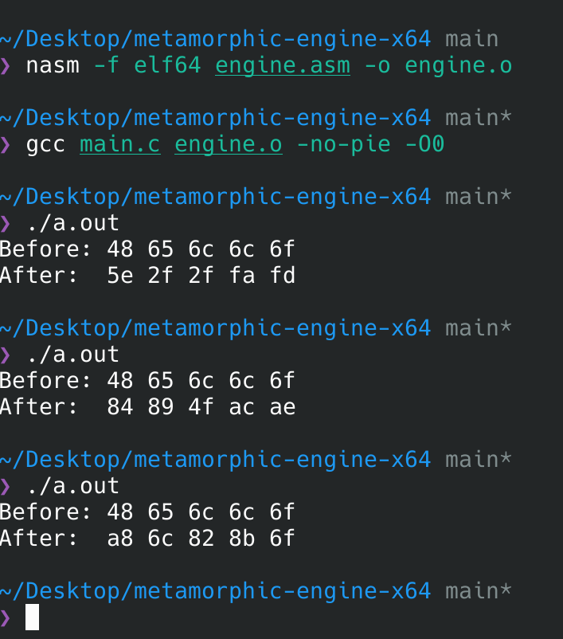

# metamorphic-engine-x64

A hybrid C / x86-64 assembly metamorphic engine demonstrating runtime binary mutation through randomized passes, instruction variants, and in-place payload transformation.

This project is an educational proof-of-concept showing how simple metamorphic techniques can be implemented at the low level and exposed cleanly to C as a reusable module.


Each execution applies randomized mutation passes (XOR, ADD, rotate, swap), producing different byte sequences while preserving program flow.
---

## Overview

`metamorphic-engine-x64` implements a small mutation engine written in NASM that operates on arbitrary memory regions provided by C.

On each run, the engine:

- Seeds an internal RNG using `rdtsc`
- Chooses a random number of mutation passes
- Applies randomized transformations such as:
  - XOR with random keys
  - ADD with random values
  - Bit rotations
  - Byte swapping
- Produces different binary output every execution

The C side simply provides a buffer and length, making the engine easy to embed into most C programs.

The goal is not obfuscation strength, but clarity and experimentation: demonstrating how metamorphic behavior can be achieved with minimal infrastructure.

---

## Features

- Pure x86-64 NASM mutation core
- Simple C integration
- Multiple randomized mutation passes per run
- Custom xorshift RNG
- Position-independent design
- Minimal dependencies
- Easy to extend with new mutation primitives

---

## Build

```bash
nasm -f elf64 engine.asm -o engine.o
gcc main.c engine.o -no-pie -O0
./a.out
